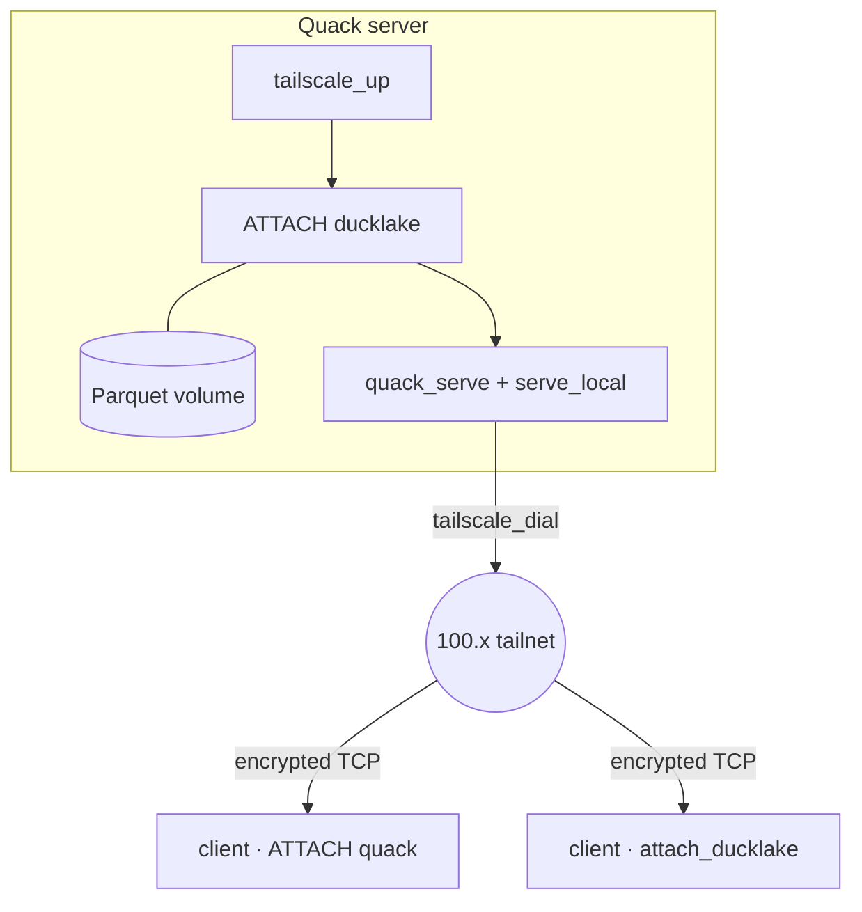

# QuackScale

QuackScale embeds a Tailscale client ([libtailscale](https://github.com/tailscale/libtailscale)) inside DuckDB. A DuckDB process joins your private [Tailscale](https://tailscale.com/) network ([tailnet](https://tailscale.com/docs/concepts/tailnet)) and reaches its peers over encrypted WireGuard. It needs no VPN sidecar and opens no public port.

Once your process is on the tailnet, you read any HTTP asset a peer serves as if it sat on local disk. `FROM read_csv('http://my-laptop.ts.net:8000/sales.csv')` pulls the file straight off another machine over the encrypted mesh, with no public URL and no copy step.

Pair it with DuckDB's [Quack](https://duckdb.org/docs/current/quack/overview) HTTP protocol and you have **QuackTail**: SQL engines that find each other on `100.x` addresses and [MagicDNS](https://tailscale.com/docs/features/magicdns), then run `ATTACH`, `quack_query`, and DuckLake workloads across the mesh.

```sql
LOAD quack;       -- HTTP server, ATTACH, quack_query
LOAD quackscale;  -- join the tailnet, dial, forward, serve
```

QuackScale is the network layer that carries DuckDB's HTTP across a tailnet, from a plain file read to `quack` and `ducklake`.

## Why QuackScale

Most teams expose a SQL engine by walling it off. You bind DuckDB or Quack to localhost, where nothing can reach it, or you bind a public IP and defend it with TLS certificates, firewall rules, and a VPN appliance. The database has no identity of its own. It trusts whatever the perimeter lets through.

QuackScale inverts that. Each DuckDB process carries its own tailnet identity and speaks WireGuard ([how Tailscale works](https://tailscale.com/blog/how-tailscale-works)) to the peers your control plane already trusts. Nothing listens on the public internet, so you have nothing there to defend.

| | Perimeter model | QuackTail |
|---|---|---|
| What listens publicly | A public IP with TLS, firewall, and VPN in front | Nothing public; Quack binds loopback and serves the mesh |
| What the database trusts | Whatever the perimeter admits | Peers its control plane already trusts |
| Encryption | TLS you configure and renew | WireGuard between every node |
| Reaching across networks | Manual port forwarding, VPN appliance | Direct paths or DERP relays |
| Extra process to run | A VPN daemon or appliance | None; tsnet runs in-process |

Each node clears two independent checks. The tailnet asks whether the machine belongs to your mesh, and Tailscale or [Headscale](https://github.com/juanfont/headscale) ACLs decide which nodes may open a connection. A Quack token then asks whether the caller may run SQL. A stolen token buys nothing from a machine off the mesh, and a machine on the mesh still needs a token. Set `QUACK_TAILNET_TOKEN` once and the whole fleet shares one secret. See [docs/AUTHENTICATION.md](docs/AUTHENTICATION.md).

You drive all of it from SQL. Joining, status, ping, forward, serve, and teardown are `CALL` table functions, so you keep the network in the same migrations and init scripts as your data. One SQL surface covers Tailscale's hosted control plane and a self-hosted [Headscale](https://headscale.net/): set `control_url` and a preauth key, and nothing else changes.

## Install

QuackScale needs **DuckDB v1.5.3** and unsigned extensions. Install from the custom extension repository:

```sql
INSTALL quackscale FROM community;
LOAD quackscale;
```

From the CLI, start `duckdb -unsigned`, then `LOAD quackscale;`.

You also need `quack` (and `ducklake`, for lake workloads) from `core_nightly`:

```sql
INSTALL quack FROM core_nightly; LOAD quack;
```

Prebuilt QuackTail binary bundles ship on each [release](https://github.com/quackscience/duckdb-quackscale/releases). To build from source, see [docs/DEVELOPMENT.md](docs/DEVELOPMENT.md).

## Quick start

### A server others can reach

```sh
export TS_AUTHKEY='tskey-auth-...'              # Tailscale auth key, or a Headscale preauth key
export QUACK_TAILNET_TOKEN='your-shared-token'  # one shared secret for the whole fleet
duckdb -unsigned
```

```sql
LOAD quack;
LOAD quackscale;

CALL tailscale_up(
    hostname  => 'my-duckdb-node',
    state_dir => '~/.local/share/duckdb/quackscale'
);

CALL quack_serve('quack:127.0.0.1:9494', allow_other_hostname => true, token => quack_token());
CALL tailscale_serve_local(port => 9494);

FROM quack_discover();   -- prints this node's quack: URI on the tailnet
```

Leave a long-lived server running with a persistent `state_dir`, and do not call `tailscale_down()`. For Headscale, add `control_url` and a preauth key. See [docs/AUTHENTICATION.md](docs/AUTHENTICATION.md).

### A client that reaches it

After `tailscale_up`, tailnet `quack:` addresses route over the mesh on their own. Attach the address `quack_discover()` printed on the server, with no forwarder:

```sql
LOAD quack;
LOAD quackscale;

CALL tailscale_up(hostname => 'my-client', state_dir => '~/.local/share/duckdb/quackscale-client');

CREATE SECRET (TYPE quack, TOKEN 'your-shared-token', SCOPE 'quack:100.x.x.x:9494');
ATTACH 'quack:100.x.x.x:9494' AS remote (TYPE quack, DISABLE_SSL true);

FROM remote.query('SELECT 42');

DETACH remote;
CALL tailscale_down();   -- a one-shot client must close tsnet, or the process hangs
```

## How it fits together



A server joins the tailnet with `tailscale_up`, attaches a DuckLake catalog when it owns one, and serves Quack on loopback through `quack_serve` and `tailscale_serve_local`. Clients reach it over encrypted TCP across the mesh, and no node listens on the public internet.

`tailscale_up` wraps DuckDB's HTTP layer. QuackScale then dials any tailnet host you name (`100.64.0.0/10` or `*.ts.net`) over tsnet, so `ATTACH 'quack:100.x:9494'` works on its own. Pass `http_route => false` to turn this off. Three cases fall outside the router: a bare MagicDNS short name, a pinned `127.0.0.1:<port>` endpoint, and a non-HTTP client. For those, `tailscale_quack_forward` listens on loopback and dials the peer. To read a server-owned DuckLake catalog, call `attach_ducklake`. The [guide](docs/GUIDE.md) works through each pattern.

## Where to next

| You want to… | Read |
|--------------|------|
| Pick a pattern: remote tables, server-owned DuckLake, or shared Parquet | [docs/GUIDE.md](docs/GUIDE.md) |
| Set up tailnet login, Headscale, and Quack tokens | [docs/AUTHENTICATION.md](docs/AUTHENTICATION.md) |
| Look up a SQL command and its parameters | [docs/REFERENCE.md](docs/REFERENCE.md) |
| Run a two-node proof on Docker Compose | [examples/README.md](examples/README.md) |
| Build the extension, or work on it | [docs/DEVELOPMENT.md](docs/DEVELOPMENT.md) |

## License

MIT, from the [DuckDB extension template](https://github.com/duckdb/extension-template). libtailscale is [BSD-3-Clause](https://github.com/tailscale/libtailscale/blob/main/LICENSE).
