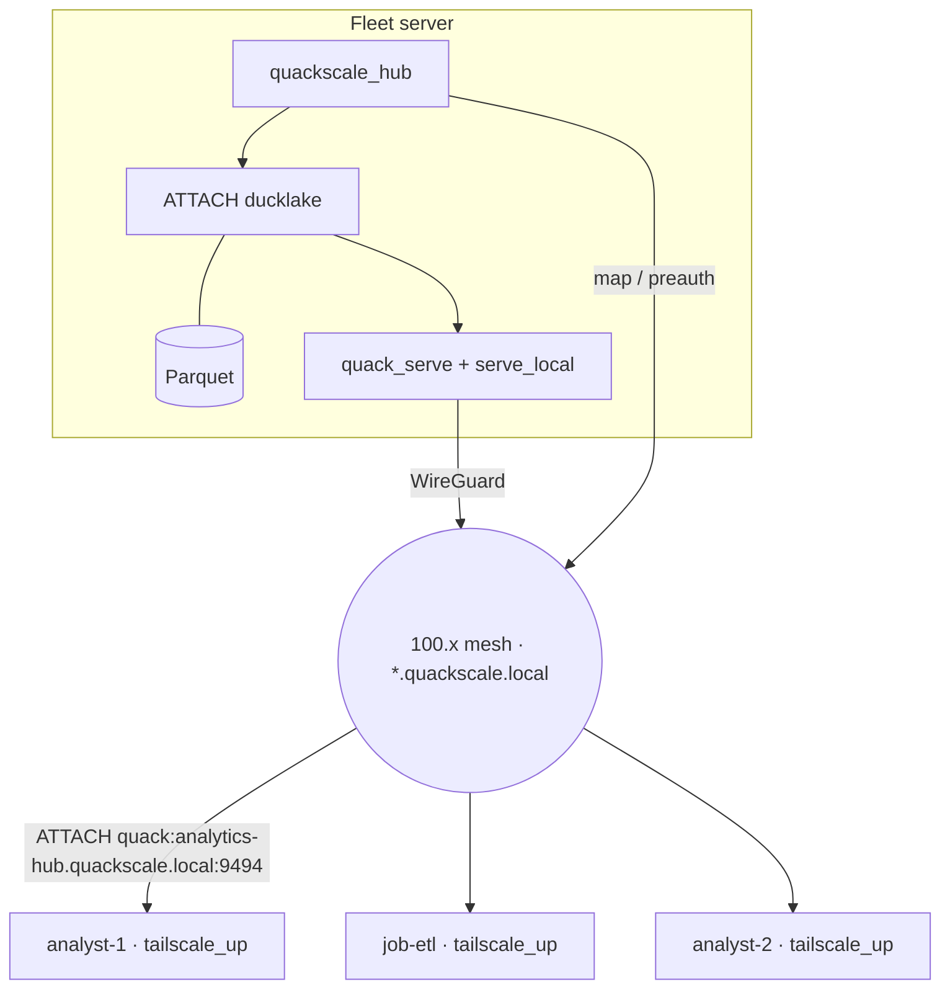

# QuackScale

QuackScale turns a set of DuckDB processes into a **query fleet** on a private WireGuard mesh. One process is the **hub**: it hosts the control plane and serves SQL. Every other process is a **client**: it joins that hub and `ATTACH`es the server as if it were local.

No Tailscale account, no Headscale container, no public port. Peers find the server at `analytics-hub.quackscale.local`.

```sql
LOAD quack;       -- HTTP server, ATTACH, quack_query
LOAD quackscale;  -- quackscale_hub on the server, tailscale_up on every client
```

Pair it with DuckDB's [Quack](https://duckdb.org/docs/current/quack/overview) protocol and you have **QuackTail**: engines that `ATTACH`, `quack_query`, and run DuckLake across the mesh.

You can still join a hosted [Tailscale](https://tailscale.com/) tailnet or a [Headscale](https://github.com/juanfont/headscale) server with the same `CALL tailscale_up`. The default path is the in-process hub.

## Why QuackScale

Most teams expose a SQL engine by walling it off. You bind DuckDB or Quack to localhost, where nothing can reach it, or you bind a public IP and defend it with TLS certificates, firewall rules, and a VPN appliance. The database has no identity of its own.

QuackScale inverts that. Each DuckDB process carries its own mesh identity and speaks WireGuard to the peers the hub already trusts. Nothing listens on the public internet.

| | Perimeter model | QuackTail fleet |
|---|---|---|
| What listens publicly | A public IP with TLS, firewall, and VPN in front | Nothing public; Quack binds loopback and serves the mesh |
| What the database trusts | Whatever the perimeter admits | Peers the hub already admitted |
| Encryption | TLS you configure and renew | WireGuard between every node |
| Extra process to run | A VPN daemon or Headscale | None; hub and clients run in-process |

Each node clears two checks. The mesh asks whether the machine belongs to this fleet. A Quack token then asks whether the caller may run SQL. Set `QUACK_TAILNET_TOKEN` once for the whole fleet. See [docs/AUTHENTICATION.md](docs/AUTHENTICATION.md).

## Install

QuackScale needs **DuckDB v1.5.5** and unsigned extensions.

```sql
INSTALL quackscale FROM community;
LOAD quackscale;
INSTALL quack FROM core_nightly; LOAD quack;
```

From the CLI: `duckdb -unsigned`, then `LOAD quackscale;`. A hub-linked source build reports `SELECT linked FROM quackscale_status()` as `true` (checkout [wirebone.cpp](https://github.com/lmangani/wirebone.cpp) next to this repo). Community builds without the hub still join Tailscale or Headscale. Prebuilt bundles: [releases](https://github.com/quackscience/duckdb-quackscale/releases). From source: [docs/DEVELOPMENT.md](docs/DEVELOPMENT.md).

## Quick start: a query fleet

One long-lived **server** is the hub and the Quack endpoint. Any number of **clients** (laptops, jobs, other DuckDBs) join with the same control URL and a `wbkey-` from the hub.

```sh
export QUACK_TAILNET_TOKEN='your-shared-token'   # same secret on every node
```

### 1. Start the server

Leave this process running. Do not call `tailscale_down()` or `quackscale_stop()`.

```sql
LOAD quack;
LOAD quackscale;

CALL quackscale_hub(
    hostname   => 'analytics-hub',
    listen     => '0.0.0.0:8080',
    server_url => 'http://10.0.0.5:8080',   -- address clients can open
    state_dir  => '~/.local/share/duckdb/quackscale'
);

CALL quackscale_preauth(reusable => true);   -- fleet key; share with every client
SELECT * FROM quackscale.preauth_keys;
SELECT * FROM quackscale.nodes;

CREATE TABLE IF NOT EXISTS events (id INTEGER, payload VARCHAR);

CALL quack_serve('quack:127.0.0.1:9494', allow_other_hostname => true, token => quack_token());
CALL tailscale_serve_local(port => 9494);
FROM quack_discover();
```

`server_url` must be reachable from clients (`127.0.0.1` only if they share the host). Copy a `wbkey-…` from `quackscale.preauth_keys`.

### 2. Join a client

Repeat on every other DuckDB in the fleet. Change `hostname` per machine.

```sql
LOAD quack;
LOAD quackscale;

CALL tailscale_up(
    hostname    => 'analyst-1',             -- analyst-2, job-etl, …
    control_url => 'http://10.0.0.5:8080',
    authkey     => 'wbkey-…',
    state_dir   => '~/.local/share/duckdb/quackscale-analyst-1'
);

CREATE SECRET (
    TYPE quack,
    TOKEN 'your-shared-token',
    SCOPE 'quack:analytics-hub.quackscale.local:9494'
);
ATTACH 'quack:analytics-hub.quackscale.local:9494' AS hub (TYPE quack, DISABLE_SSL true);

FROM hub.query('SELECT 42');
SELECT * FROM hub.events;

DETACH hub;
CALL tailscale_down();   -- one-shot jobs must close tsnet, or the process hangs
```

A second client is the same SQL with `hostname => 'job-etl'` and its own `state_dir`. On the server, `SELECT * FROM quackscale.nodes` lists the fleet.

If MagicDNS fails, attach the `100.x` from `quackscale.nodes` or `quack_discover()`, or `CALL tailscale_quack_forward(host => 'analytics-hub', port => 9494)`. Two-process walkthrough: [examples/wirebone](examples/wirebone/README.md).

### Join Tailscale or Headscale instead

Clients still call `tailscale_up`. For Tailscale SaaS, omit `control_url` and set `TS_AUTHKEY`. For Headscale, pass that server's URL and a Headscale preauth key. See [docs/AUTHENTICATION.md](docs/AUTHENTICATION.md).

## How it fits together


```mermaid
flowchart TB
    subgraph server["Fleet server"]
        s1[quackscale_hub]
        dl[ATTACH ducklake]
        pq[(Parquet)]
        sq[quack_serve + serve_local]
        s1 --> dl
        dl --- pq
        dl --> sq
    end

    m((100.x mesh · *.quackscale.local))
    s1 -->|map / preauth| m
    sq -->|WireGuard| m

    c1["analyst-1 · tailscale_up"]
    c2["job-etl · tailscale_up"]
    c3["analyst-2 · tailscale_up"]

    m -->|ATTACH quack:analytics-hub.quackscale.local:9494| c1
    m --> c2
    m --> c3
```

The server is the control plane **and** a mesh member (`join` defaults to true). It serves Quack on loopback through `quack_serve` and `tailscale_serve_local`. Clients `ATTACH` over the mesh; nothing listens on the public internet.

`tailscale_up` (and the hub, after it joins) wrap DuckDB's HTTP layer so `100.64.0.0/10`, `*.quackscale.local`, and `*.ts.net` dial over tsnet. Pass `http_route => false` to turn that off. Bare MagicDNS short names, a pinned `127.0.0.1:<port>`, and non-HTTP clients still need `tailscale_quack_forward`. Server-owned DuckLake: `attach_ducklake`. Patterns: [docs/GUIDE.md](docs/GUIDE.md).

## Where to next

| You want to… | Read |
|--------------|------|
| Run the hub server + a client on one machine | [examples/wirebone](examples/wirebone/README.md) |
| Pick a query pattern: remote tables, DuckLake, shared Parquet | [docs/GUIDE.md](docs/GUIDE.md) |
| Tokens, extra preauth keys, Tailscale / Headscale | [docs/AUTHENTICATION.md](docs/AUTHENTICATION.md) |
| SQL commands and parameters | [docs/REFERENCE.md](docs/REFERENCE.md) |
| Headscale Docker Compose demo | [examples/README.md](examples/README.md) |
| Build from source | [docs/DEVELOPMENT.md](docs/DEVELOPMENT.md) |

## License

MIT, from the [DuckDB extension template](https://github.com/duckdb/extension-template). libtailscale is [BSD-3-Clause](https://github.com/tailscale/libtailscale/blob/main/LICENSE). Wirebone is [MIT](https://github.com/lmangani/wirebone.cpp).
